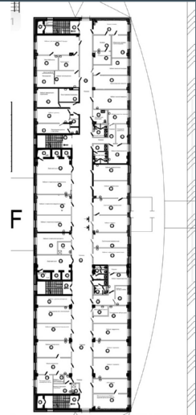
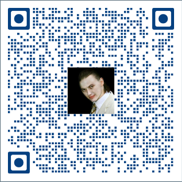

# Mozz
Тестовое задание компании Mozz

## ТЗ

### Часть 1:

Сделать приложение **WebGL** доступное по ссылке из **QR** кода. 

Пользователь выбирает кабинет, после чего нажимает кнопку "В путь", стрелочка двигается по карте (простая схема здания)

Тестовая карта:

### Часть 2:

Стрелочка должна двигаться автоматически когда движется пользователь используя данные о положении телефона.

### Часть 3:

Определить начальную позицию телефона в здании.

## Результат:

Тестирование показало, что под WebGl акселерометр и геолокация для iPhone не доступны. 

На Android работают оба варианта, остается выбрать вариант геолокацию использовать или акселерометр. 

Определять изначальную позицию внутри здания по геолокации невозможно. 
Хорошим вариантом была бы идея определять начальную позицию сканируя QRкод развешанный в здании или выбирать в приложении откуда запустить навигатор. 

